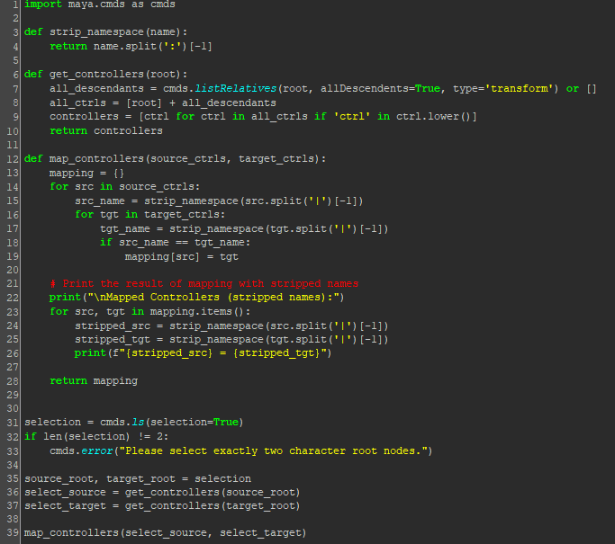

# 🛠️ Copy Animation Script – Process Documentation

## Welcome & Overview
This Python script was created to help me copy and paste animation keyframes from one character rig to another in Autodesk Maya. It will take two set of controller rigs *with the same naming convention* and copy from one (the source) to the other (the target). My goal was to make the process automatic, namespacing-free, and reliable across similar characters. I also wrapped the script in a simple user interface to make it quick to use from the Maya shelf. Before I began creating the script, I first wrote down some notes of what I wanted this script to include.

The overall logic is:
- Get all animation controllers from both rigs
- Match them based on name
- Transfer keyframes from source to target
- Wrap it all in a clean UI with a single button

I will guide you through my steps, processes and logic in this documentation.
Also in Maya, it has it's own module that can be used within Python to access it's commands like you would using MEL scripting. This is done by using the following line of code:
```python
import maya.cmds as cmds
```

If you would like to see a list of Maya commands for Python, here is the link:
https://help.autodesk.com/view/MAYAUL/2024/ENU/?guid=__CommandsPython_index_html

---

## Step 1: Getting the Controllers

I started by creating a function called `get_controllers()` to gather all the controller names within the root node hierarchy. To do this, I used a Maya command called `listRelatives`. This command will list the parents and children of the given object. Below is the Python code I used, along with explanations of the flags used:

```python
 all_descendants = cmds.listRelatives(root, allDescendents=True, fullPath=True, type='transform') or []
``` 
allDescendents = True -> Returns all children, grandchildren, and deeper descendants of the selected object.
fullPath = True -> Returns the full DAG(directed acyclic graph) path of each object. This ensures Maya knows exactly which object to target when copying keyframes later.
type='transform' -> Limits the result to only transform nodes, filtering out shapes, joints, etc.
"or []" -> Ensures `all_descendants` is set to an empty list if no descendants are found, preventing runtime errors.

Let’s say I have the following controller hierarchy in Maya:


To test what this command does, I wrote a small script:


When I select the root controller and run the script, the output looks like this:


As you can see, the result is a list of the objects inside the hierarchy of the selected root. The list includes full DAG paths, which can make it look long, but it’s useful for ensuring the script interacts with the exact intended nodes.  

For example, the list might contain:
["|char_root|ctrl_01_G", "|char_root|ctrl_01", "|char_root|ctrl_02", "|char_root|ctrl_03"]

This list gives me a complete picture of the controller structure under the root, which I can use later to compare the source and target controllers for animation transfer.

#### Including the Root Controller

One thing I noticed is that `listRelatives()` does not include the root controller itself. While this might not seem like a big issue, since it's rarely used in my current work environment, I decided to include it anyway just in case. To solve this minor issue, I created a new variable called `all_ctrls`:

``` python
all_ctrls = [root] + all_descendants
```
This puts the root controller at the start of the list, followed by all its child controllers.

#### Filtering Controllers by Naming Convention

From my experience, some rigs may group controllers together with bones or place them in special group structures. These may not always need animation applied to them. To filter out non-controller nodes, I relied on a naming convention. The controllers should include the string "ctrl" in their names, such as "ctrl", "Ctrl", or "CTRL".

To implement this, I wrote a simple filter using a list comprehension and the `.lower()` method to ensure the search is case-insensitive. This catches names like "Spine_CTRL" or "hip_Ctrl" even if the casing isn’t consistent.

#### Final Function

Here’s the final version of my `get_controllers()`` function:
```python
def get_controllers(root):
    all_descendants = cmds.listRelatives(root, allDescendents=True, type='transform') or []
    all_ctrls = [root] + all_descendants
    controllers = [ctrl for ctrl in all_ctrls if '_ctrl' in ctrl.lower()]
    return controllers
```

This returns a clean list of all controller objects under the root, including the root itself, and filters based on the naming convention.

---

## Step 2: Mapping Controllers by Name

Once I had the `get_controllers()` function in place, the next step was to create a function that matches controllers from the source and target characters based on their names. This is a crucial part of the script because animation data can only be transferred if we know which controller in the source corresponds to which one in the target. 

The basic logic is:
- Loop through each controller in the source list.
- For each one, try to find a matching controller in the target list based on name.

#### Using `split('|')[-1]` to isolate node names for comparison
When using `listRelatives(..., fullPath=True)`, Maya returns the full DAG path of each node. This includes all parent nodes leading to the object, separated by the '|' character. Since we only care about the actual controller name (not the full path), we can isolate it using:
```python
ctrl.split('|')[-1]
```
This splits the path string by the '|' and grabs the last part, which is the name of the controller node itself.

#### Mapping Logic

I created a function called `map_controllers()` that does the following:
- Loops through each controller in the source list
- Gets the base name of the source controller using `split('|')[-1]`
- Loops through the target controllers to find a match using the same method as the loop for source list
- If the names match, the pair is added to a dictionary in the form `{source_ctrl: target_ctrl}`.

Here’s what the function look like:
```python
def map_controllers(source_ctrls, target_ctrls):
    mapping = {}
    for src in source_ctrls:
        src_name = src.split('|')[-1] 
        for tgt in target_ctrls:
            tgt_name = tgt.split('|')[-1]
            if src_name == tgt_name:
                mapping[src] = tgt
    return mapping

```
#### Testing the Map Function

To test if the function works correctly, I created two sets of controllers in Maya (one for the source and one for the target) with matching names. Then I ran a script that uses both the `get_controllers()` and `map_controllers()` functions.

You can see the setup and test script below:


The result was:


The result confirms that the `map_controllers()` function works as intended. Each controller from the source list is correctly matched with its counterpart in the target list, and the mapping is stored in a dictionary.

#### Namespace Issue
At this stage, I hadn’t accounted for namespaces. In Maya, namespaces are commonly used when referencing or importing multiple characters or assets into a scene. They help organize nodes and prevent naming conflicts, but they also add prefixes like:
*charA:spine_ctrl*
*charB:spine_ctrl*

Even though these are the "same" controller logically, the presence of the namespace means their names won't match.
I’ll handle this in the next step by stripping namespaces before comparing names.

---

## Step 3: Handling Namespaces

After getting the mapping function working, I realized there was still an issue that could prevent the script from working as expected. That issue would be namespaces. n Maya, namespaces are commonly used when referencing or importing multiple rigs into the same scene. They're a helpful way to prevent naming conflicts between characters, and I use them quite often in my own work. However, namespaces interfere with name-based comparisons in this script.

#### Why namespaces break the comparison

In the original `map_controllers()` function, I compared controller names using the following lines:

```python
src_name = src.split('|')[-1]
tgt_name = tgt.split('|')[-1]
```

This works fine if both source and target controllers are named something like "spine_Ctrl". But when namespaces are present, especially when the files are imported or referenced, you'll see something like this:
- charA:spine_Ctrl
- charB:spine_Ctrl

Even though they both end in "spine_Ctrl", the namespace prefixes "charA:" and "charB:" cause the names to differ. As a result, the mapping function doesn't see them as a match, and the animation won’t be transferred. 

#### Creating a function to strip namespaces

To fix this, I created a function called `strip_namespace()` that removes the namespace portion from a node name. Here's what it looks like:

```python
def strip_namespace(name):
    return name.split(':')[-1]
```

This splits the name by the `:` character, which is used for namespaces in Maya, and returns just the last part.
For example:
strip_namespace("charA:spine_Ctrl") → "spine_Ctrl"

Once this function was in place, I updated `map_controllers()` to use it when comparing names. I also made sure it still isolates the base node name from the full path using `split('|')[-1]`, just like before.

#### Updated mapping function

Here's the revised version of `map_controllers()` that includes the `strip_namespace()`:
```python
def map_controllers(source_ctrls, target_ctrls):
    mapping = {}
    for src in source_ctrls:
        src_name = strip_namespace(src.split('|')[-1])
        for tgt in target_ctrls:
            tgt_name = strip_namespace(tgt.split('|')[-1])
            if src_name == tgt_name:
                mapping[src] = tgt
    return mapping
```

This function is now much more reliable, even when working with characters referenced into the scene under different namespaces.

#### Testing the result

To test this change, I created two character hierarchies in Maya with namespaces applied (`charA:root_ctrl`, `charB:root_ctrl`).  I ran the updated script and confirmed that the controller names were still matched correctly, even though their full names in the scene had different prefixes.





The result showed that all controllers were correctly paired across namespaces, and animation data transferred as expected.

With namespace handling now built into the script, the next step is building the function that actually transfers the keyframes between the mapped controller pairs.

---

## Step 4: Transferring Keyframes

Now that the controller mapping is working, the next step is to actually transfer the animation from the source controllers to the corresponding target controllers. This is where the animation data gets copied and pasted. To make this happen, I wrote a function called `transfer_keys()`.

#### What the function needs to do

For each matching pair of source and target controllers, I needed to:

- Find all animatable attributes on the source controller (such as translate, rotate, etc.).
- Copy the keyframes on those attributes.
- Clear any existing keys on the corresponding attributes of the target controller.
- Paste the keyframes onto the target controller's attributes.

#### Maya Commands Used

- cmds.listAnimatable() → Lists all keyable/animated attributes on a node.
- cmds.copyKey() → Copies keyframes from a specific attribute.
- cmds.cutKey(clear=True) → Clears all keyframes from a target attribute before pasting.
- cmds.pasteKey() → Pastes previously copied keyframes to a new target.
- cmds.objExists() → Check to see whether an object with the given name exists

These are standard Maya animation commands that work well together and make the transfer reliable.

#### The `transfer_keys()` function

Here's what the function looks like:
```python
def transfer_keys(source, target):
    attrs = cmds.listAnimatable(source)
    if not attrs:
        return

    for attr in attrs:
        if cmds.objExists(attr):
            short_attr = attr.split('.')[-1]
            target_attr = f"{target}.{short_attr}"
            if cmds.objExists(target_attr):
                cmds.cutKey(target_attr, clear=True)
                cmds.copyKey(source, attribute=short_attr)
                try:
                    cmds.pasteKey(target, attribute=short_attr)
                except RuntimeError:
                    # Handles "Nothing to paste from" without stopping the script
                    continue

```

#### How it works

- It first gathers all the animatable attributes from the source controller.
- For each attribute, it will:
    - Get the short name (just the attribute name, like rotateZ).
    - Build the equivalent attribute on the target controller (target.attr).
    - Clear any keyframes that already exist on that target attribute.
    - Copy the source animation.
    - Paste it to the target.

I also included a `try/except` block around `pasteKey()` because Maya can sometimes throw a "Nothing to paste from" error if the source controller doesn’t have any keyframes on that attribute. The `continue` makes sure the script keeps going without crashing.

Since this was the final core function needed for the script’s functionality, I decided to test it only after building a main function that brings all the individual parts together. This way, I could test everything in one go.

---

## Step 5: Building the Animation Copy Function

After finishing the `transfer_keys()` function, I wanted a way to run the entire animation transfer process in one go, from gathering the controllers, to mapping them, to copying the keyframes. That’s where the `copy_animation()` function comes in.

This function acts as the central coordinator. It calls the other functions I wrote (`get_controllers()`, `map_controllers()`, and `transfer_keys()`), and executes them in the correct order.

#### What `copy_animation()` does

- Takes two root nodes: one for the source character, one for the target.
- Finds all controllers under each root using `get_controllers()`.
- Maps the controllers between source and target using `map_controllers()`.
- Loops through each mapped controller pair and transfers the keyframes using `transfer_keys()`.

#### The function
Here's the what the function looks like:
```python
def copy_animation(source_root, target_root):
    source_ctrls = get_controllers(source_root)
    target_ctrls = get_controllers(target_root)

    mapping = map_controllers(source_ctrls, target_ctrls)
    if not mapping:
        cmds.warning("No matching controllers found.")
        return

    for src, tgt in mapping.items():
        transfer_keys(src, tgt)

    cmds.inViewMessage(amg="Animation transfer complete", pos='midCenter', fade=True)

```

#### Additional things I added for the function

- I added a check to warn the user if no controller mappings were found. This avoids a silent failure if the script doesn’t detect any matches.
- I used a simple for loop to process each mapped pair and call `transfer_keys()`.
- At the end, I added a small inViewMessage() to give visual confirmation in Maya’s viewport once the process finishes. This will let the user know everything completed successfully.

#### Testing the full animation transfer

To test this, I selected two root nodes — one for the source character and one for the target. I then called copy_animation() with those two as arguments. The animation on the source was successfully transferred to the target.


Everything worked as expected: controllers were matched correctly, existing keyframes on the target were cleared, and new animation was pasted cleanly.

With this function in place, the script now fully automates the animation transfer process. In the next step, I’ll build a simple UI to make it easier to run this script without having to use the Script Editor every time.

---

## Step 6: Creating the User Interface

Once the core functionality of the script was working, I wanted to make it easier to use. This will be helpful especially for artists or teammates who might not want to dig into the Script Editor every time. The solution was to build a simple UI using Maya’s native Python UI commands (`cmds.window`, `cmds.columnLayout`, etc.).

The goal was to allow a user to:
- Select two root controllers (source first, then target).
- Click a button to trigger the animation transfer.

#### Basic UI Layout

The UI is made up of the following elements:
- A single instruction label telling the user to select two root nodes.
- A large "Copy Animation" button to run the process.
- A viewport message to confirm when the transfer is complete.

Here's the code for the UI Function:
```python
def show_copy_anim_ui():
    if cmds.window("copyAnimUI", exists=True):
        cmds.deleteUI("copyAnimUI")

    window = cmds.window("copyAnimUI", title="Copy Animation Tool", widthHeight=(350, 80), sizeable=True)
    cmds.columnLayout(adjustableColumn=True, rowSpacing=10, columnAlign='center', columnAttach=('both', 20))

    cmds.text(label="Select Source and Target Root Nodes in the Viewport", align='center')

    cmds.button(label="Copy Animation", height=40, bgc=(0.3, 0.6, 0.3), 
                command=lambda *_: on_copy_button())

    cmds.setParent("..")
    cmds.showWindow(window)

```

#### Handling the Button Click

The `"Copy Animation"` button triggers the `on_copy_button()` function, which checks that exactly two objects are selected, and then passes them to `copy_animation()`.

```python
def on_copy_button():
    selection = cmds.ls(selection=True)
    if len(selection) != 2:
        cmds.warning("! Please select exactly 2 character root nodes: source, then target.")
        return

    source_root, target_root = selection
    copy_animation(source_root, target_root)

```

With the `show_animation_transfer_ui()` and the `on_copy_button()` functions done, the tool is now ready to be used! All that is left is to add the `show_animation_transfer_ui()` to the last line of the script, add it to the Maya Shelf, and be used when needed.


---

## Conclusion and Reflection

As I worked through a repetitive and time consuming task at my job, I had a spark of an idea to create a script for it, which was to make it easier to copy and paste animation from one character rig to another using Python in Maya. What began as a small utility evolved into a fully functional and flexible tool that handles naming conventions, namespaces, and user interaction through a UI.

Throughout the process, I learned a lot about how Maya structures its scene data and how to build tools that work with real-world production constraints. Here are a few key takeaways from this project:

- How to use listRelatives() and interpret full DAG paths to gather transform nodes accurately in a hierarchy.
- The importance of case-insensitive and pattern-based filtering when working with naming conventions (like `_ctrl`).
- How namespaces affect node names and how to strip them safely to improve compatibility across multiple rigs.
- How to build reusable functions that are modular and easy to test independently.
- How to create a simple, intuitive user interface using Maya’s cmds module.
- And lastly, how to design a tool that is easy to scale and integrate into existing pipelines.

#### Final thoughts

This script helped me automate what would normally be a repetitive, manual task in animation workflows. More importantly, it taught me how to think about tool design in a practical way.

By breaking the problem into smaller parts and building it step by step (controller gathering, name mapping, animation transfer, UI), I was able to debug and test each piece before putting everything together. This modular approach made the final script easier to maintain and expand.

If you have read till the end, I would like to thank you for spending the time to read the whole thing. I really appreciated it. Thank you!
